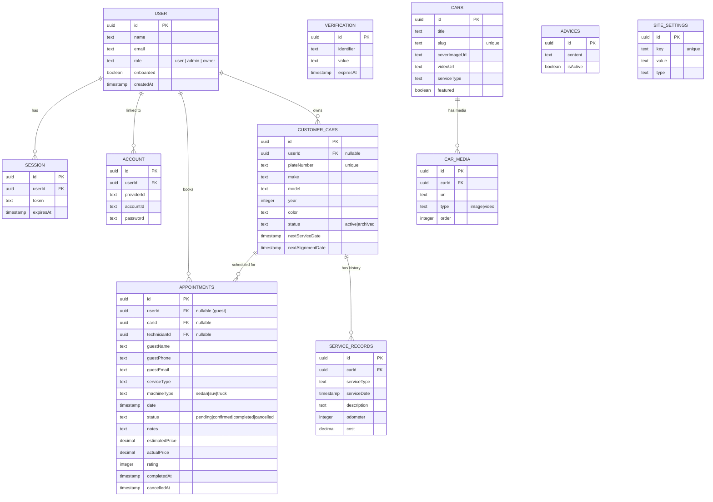

# Database ERD — The Drive Center

Source: `src/db/schema.ts`

```mermaid
erDiagram
    USER {
        uuid id PK
        text name
        text email
        text role "user | admin | owner"
        boolean onboarded
        timestamp createdAt
    }

    SESSION {
        uuid id PK
        uuid userId FK
        text token
        timestamp expiresAt
    }

    ACCOUNT {
        uuid id PK
        uuid userId FK
        text providerId
        text accountId
        text password
    }

    VERIFICATION {
        uuid id PK
        text identifier
        text value
        timestamp expiresAt
    }

    APPOINTMENTS {
        uuid id PK
        uuid userId FK "nullable (guest)"
        uuid carId FK "nullable"
        uuid technicianId FK "nullable"
        text guestName
        text guestPhone
        text guestEmail
        text serviceType
        text machineType "sedan|suv|truck"
        timestamp date
        text status "pending|confirmed|completed|cancelled"
        text notes
        decimal estimatedPrice
        decimal actualPrice
        integer rating
        timestamp completedAt
        timestamp cancelledAt
    }

    CUSTOMER_CARS {
        uuid id PK
        uuid userId FK "nullable"
        text plateNumber "unique"
        text make
        text model
        integer year
        text color
        text status "active|archived"
        timestamp nextServiceDate
        timestamp nextAlignmentDate
    }

    SERVICE_RECORDS {
        uuid id PK
        uuid carId FK
        text serviceType
        timestamp serviceDate
        text description
        integer odometer
        decimal cost
    }

    CARS {
        uuid id PK
        text title
        text slug "unique"
        text coverImageUrl
        text videoUrl
        text serviceType
        boolean featured
    }

    CAR_MEDIA {
        uuid id PK
        uuid carId FK
        text url
        text type "image|video"
        integer order
    }

    ADVICES {
        uuid id PK
        text content
        boolean isActive
    }

    SITE_SETTINGS {
        uuid id PK
        text key "unique"
        text value
        text type
    }

    USER ||--o{ SESSION : "has"
    USER ||--o{ ACCOUNT : "linked to"
    USER ||--o{ APPOINTMENTS : "books"
    USER ||--o{ CUSTOMER_CARS : "owns"
    CUSTOMER_CARS ||--o{ APPOINTMENTS : "scheduled for"
    CUSTOMER_CARS ||--o{ SERVICE_RECORDS : "has history"
    CARS ||--o{ CAR_MEDIA : "has media"
```
