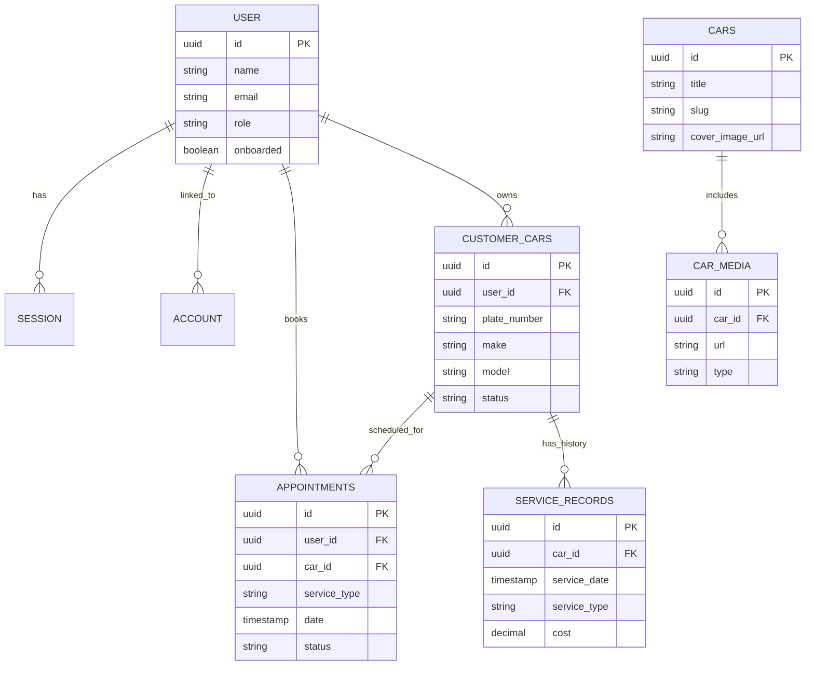

# Database ERD: The Drive Center

```mermaid
erDiagram
    USER ||--o{ SESSION : "has"
    USER ||--o{ ACCOUNT : "linked_to"
    USER ||--o{ APPOINTMENTS : "books"
    USER ||--o{ CUSTOMER_CARS : "owns"
    
    CUSTOMER_CARS ||--o{ APPOINTMENTS : "scheduled_for"
    CUSTOMER_CARS ||--o{ SERVICE_RECORDS : "has_history"
    
    CARS ||--o{ CAR_MEDIA : "includes"
    
    USER {
        uuid id PK
        string name
        string email
        string role
        boolean onboarded
    }
    
    APPOINTMENTS {
        uuid id PK
        uuid user_id FK
        uuid car_id FK
        string service_type
        timestamp date
        string status
    }
    
    CUSTOMER_CARS {
        uuid id PK
        uuid user_id FK
        string plate_number
        string make
        string model
        string status
    }
    
    SERVICE_RECORDS {
        uuid id PK
        uuid car_id FK
        timestamp service_date
        string service_type
        decimal cost
    }
    
    CARS {
        uuid id PK
        string title
        string slug
        string cover_image_url
    }
    
    CAR_MEDIA {
        uuid id PK
        uuid car_id FK
        string url
        string type
    }
```
